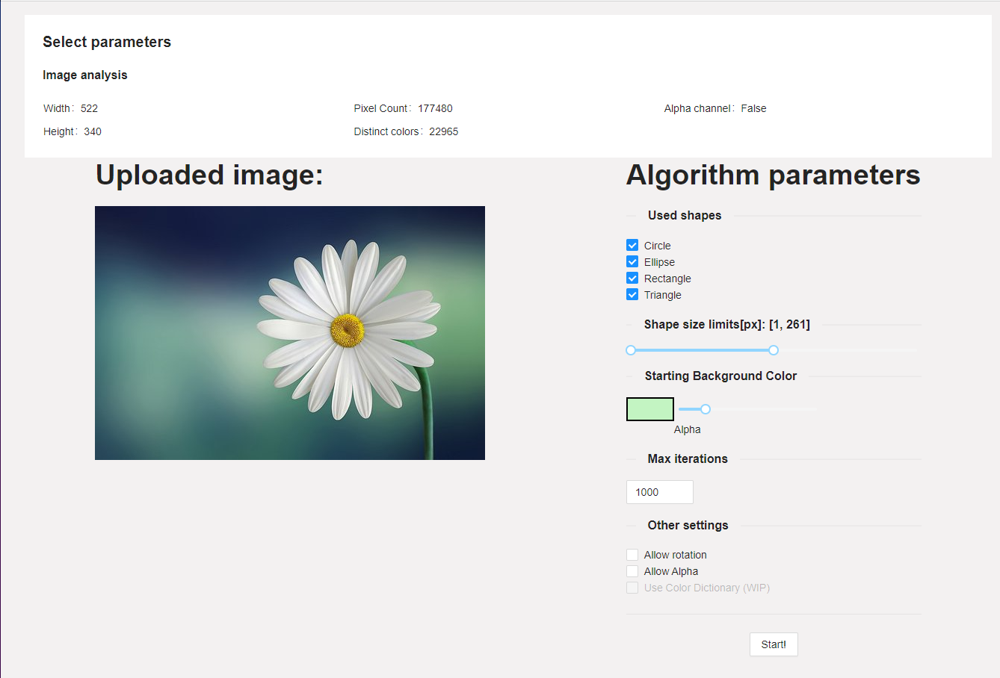

<!--
*** Thanks for checking out the Best-README-Template. If you have a suggestion
*** that would make this better, please fork the repo and create a pull request
*** or simply open an issue with the tag "enhancement".
*** Thanks again! Now go create something AMAZING! :D
***
***
***
*** To avoid retyping too much info. Do a search and replace for the following:
*** DominikNITA, HillClimbing_ImageRecreation, twitter_handle, email, project_title, project_description
-->

[![Issues][issues-shield]][issues-url]
[![LinkedIn][linkedin-shield]][linkedin-url]

<!-- PROJECT LOGO -->
<br />
<p align="center">
  <a href="https://github.com/DominikNITA/HillClimbing_ImageRecreation">
    
  </a>

  <h3 align="center">Hill Climbing Algorithm - Blazor Server</h3>

  <p align="center">
    Recreating images using randomly placed shapes
    <br />
    <a href="https://github.com/DominikNITA/HillClimbing_ImageRecreation/issues">Report Bug</a>
    ·
    <a href="https://github.com/DominikNITA/HillClimbing_ImageRecreation/issues">Request Feature</a>
  </p>
</p>

<!-- TABLE OF CONTENTS -->
<details open="open">
  <summary><h2 style="display: inline-block">Table of Contents</h2></summary>
  <ol>
    <li>
      <a href="#about-the-project">About The Project</a>
      <ul>
        <li><a href="#built-with">Built With</a></li>
      </ul>
    </li>
    <li>
      <a href="#getting-started">Getting Started</a>
      <ul>
        <li><a href="#prerequisites">Prerequisites</a></li>
        <li><a href="#installation">Installation</a></li>
      </ul>
    </li>
    <li><a href="#usage">Usage</a></li>
    <li><a href="#roadmap">Roadmap</a></li>
    <li><a href="#license">License</a></li>
  </ol>
</details>

<!-- ABOUT THE PROJECT -->

## About The Project

<p align="center">

</p>
TODO: Project description

### Built With

- Blazor Server
- AntDesign and Blazor Apex Charts
- FFmpeg

<!-- GETTING STARTED -->

## Getting Started

To get a local copy up and running follow these simple steps.

### Prerequisites

Project requires FFmpeg binaries to properly generate GIF animation after image recreation. Required version >5.0 could downloaded from https://www.gyan.dev/ffmpeg/builds

### Installation

1. Clone the repo
   ```sh
   git clone https://github.com/DominikNITA/HillClimbing_ImageRecreation.git
   ```
2. Copy ffmpeg.exe and ffprobe.exe binaries to Logic/FFmpeg. Then select option 'Copy if newer' in Copy to Output Directory in VS' properties window for these files.
<p align="center">
   
</p>
<!-- USAGE EXAMPLES -->

## Usage

Some screenshots from the application:

- Parameters page with target image analysis results
<p align="center">
   
</p>
- Generation view with current iteration, score and generated image
<p align="center">
   
</p>
- Final result with possibility to generate GIF animation
<p align="center">
   
</p>
<!-- ROADMAP -->

## Roadmap

Todo list:

- optimize score calculator
- add new parameters (color dictionary, new shapes)

<!-- LICENSE -->

## License

Distributed under the MIT License.

<!-- MARKDOWN LINKS & IMAGES -->
<!-- https://www.markdownguide.org/basic-syntax/#reference-style-links -->

[issues-shield]: https://img.shields.io/github/issues/DominikNITA/HillClimbing_ImageRecreation.svg?style=for-the-badge
[issues-url]: https://github.com/DominikNITA/HillClimbing_ImageRecreation/issues
[linkedin-shield]: https://img.shields.io/badge/-LinkedIn-black.svg?style=for-the-badge&logo=linkedin&colorB=555
[linkedin-url]: https://linkedin.com/in/DominikNITA
